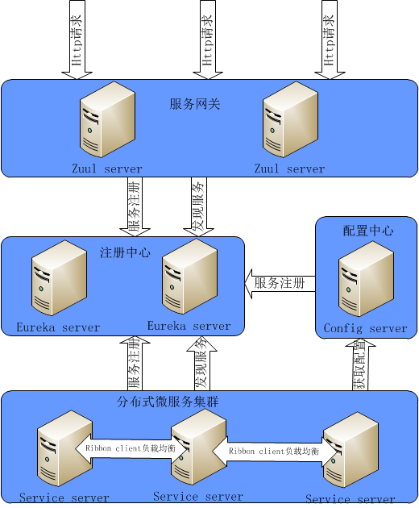
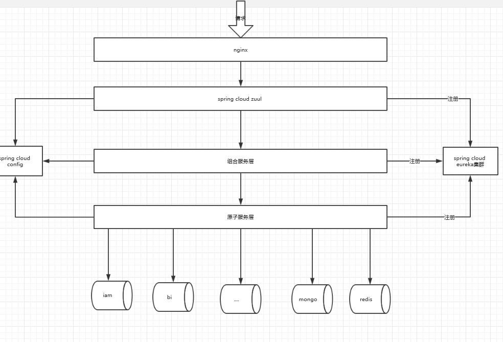

#微服务

### 名词解释
    cs - combination system 组合服务-业务微服务
    am - atom system 原子服务-数据访问微服务
    
    
### 项目结构


``` lua

hyjf_cloud 父工程，管理jar版本,模块管理，自动识别pom.xml
├── hyjf_cloud_server           -- spring cloud 组件
|     ├── hyjf_eureka           -- 注册中心[端口:8888]
|     ├── hyjf_config           -- 配置中心[端口:2222]
|     ├── hyjf_spring_boot_admin-- 服务监控[端口:18080]
|     ├── hyjf_zipkin           -- 全链路监控[端口:9411]  废弃，使用官方推荐jar
|     └── hyjf_zuul             -- 服务网关[端口:8080]
├── hyjf_base                   -- 基础模块
|   ├── hyjf-common             -- 公共模块 被依赖
|   ├── hyjf_mybatis_generator  -- mybatis自动生成工具
|   └── hyjf_ribbon_client      -- 未注册服务访问注册中心基础
├── hyjf_am_server              -- 原子服务层
|   ├── hyjf_am_model           -- 原子层统一数据模型 request vo response
|   ├── hyjf_am_util            -- 原子层工具
|   └── hyjf_am_core            -- 原子层核心服务
|   |   ├── hyjf_am_trade      -- 标的、交易、资金、资产微服务[端口:8096]
|   |   ├── hyjf_am_config      -- 公用配置微服务[端口:8091]
|   |   ├── hyjf_am_market      -- 市场微服务[端口:8094] 包含活动、券等
|   |   ├── hyjf_am_stattistics -- 统计中心微服务[端口:8095] 统计数据
|   |   └── hyjf_am_user        -- 用户中心微服务[端口:8092]
├── hyjf_cs_server
|   ├── hyjf_cs_trade          -- 核心组合微服务 [端口:8082] 
|   ├── hyjf_cs_market          -- 市场组合微服务 [端口:8083] 
|   ├── hyjf_cs_message         -- 消息组合微服务 [端口:8084] 
|   └── hyjf_cs_user            -- 用户组合微服务 [端口:8081] 
├── hyjf_platform_server        -- 平台服务
|   ├── hyjf-admin              -- 后台系统
|   ├── hyjf_batch              -- 批处理[端口:9091]
|   └── hyjf_pay                -- 银行接口模块
|        ├── hyjf_pay_server    -- 银行接口服务工程[端口:9092]
|        └── hyjf_pay_lib       -- 接口调用工具类

```

### 启动
    1. 启动注册中心 
    2. 启动配置中心 
    3. 启动微服务 按需启动
    5. 访问: 不通过网关可以直接访问组合微服务
    6. 启动服务网关zuul ,zuul启动之前必须启动am_config
        zuul 统一访问 http://localhost:8080
    7. batch 访问： http://localhost:9091
    8.监控  http://localhost:18080
    
    ps:
        本地配置host文件 （样例）：
            127.0.0.1       app.xiasq.com
            127.0.0.1       web.xiasq.com
            127.0.0.1       api.xiasq.com
            127.0.0.1       wechat.xiasq.com
        目前是根据域名区分请求渠道，不添加host文件会无法访问  
        
### 微服务架构
       
       
### 调用链
   
   